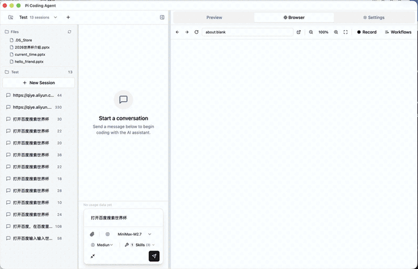

# Pi Coding Agent Desktop

基于 Electron + React 的 AI 编程助手桌面应用，提供 Web 和桌面双端体验。

## 主要功能

- **AI 对话** — 多轮对话式编程助手，支持思考过程展示和工具调用可视化
- **工作空间管理** — 创建和管理多个项目工作空间
- **会话管理** — 支持会话分组、历史查看和会话切换
- **文件浏览** — 内置文件树，支持文件浏览和管理
- **文档预览** — 支持代码高亮、Markdown、PDF、Office 文档（.docx/.xlsx/.pptx）等格式预览
- **模型配置** — 支持多种 AI 提供商和模型选择，可自定义思考等级
- **斜杠命令** — 支持 `/help`、`/clear`、`/compact`、`/model`、`/config` 等命令
- **浏览器自动化** — 支持通过 AI 驱动浏览器进行网页操作，实现自动化浏览与交互

## 功能演示

### AI 编程助手


### 浏览器自动化



## 技术栈

| 类别 | 技术 |
|------|------|
| **桌面框架** | Electron + electron-vite |
| **前端框架** | React 19 + TypeScript |
| **Web 构建** | Vite |
| **UI** | Tailwind CSS + shadcn/ui (Radix) |
| **状态管理** | Zustand + TanStack React Query |
| **代码编辑器** | Monaco Editor |
| **文档预览** | PDF.js、Mammoth (.docx)、SheetJS (.xlsx) |
| **构建工具** | Turborepo + pnpm workspace |
| **AI SDK** | @earendil-works/pi-coding-agent |

## 架构概览

项目采用 monorepo 架构，桌面端和 Web 端共享同一套 UI 组件，仅传输层不同：

```
桌面端:  Renderer (React) ──IPC──▶ Main Process ──▶ SDK ──▶ AI Backend
Web 端:  Browser (React)   ──HTTP─▶ Vite API Proxy ──▶ SDK ──▶ AI Backend
```

```
pi-coding-agent-desktop/
├── apps/
│   ├── desktop/          # Electron 桌面应用
│   │   ├── src/main/     # 主进程 (窗口管理、IPC 处理)
│   │   ├── src/preload/  # 预加载脚本 (contextBridge)
│   │   └── src/renderer/ # 渲染进程 (React)
│   └── web/              # Web 应用
├── packages/
│   ├── sdk-wrapper/      # SDK 封装层 (IPC/HTTP 双传输)
│   ├── types/            # 共享类型定义
│   └── ui/               # 共享 UI 组件库 (布局、聊天、预览等)
├── plugins/              # 首方插件 (不属 pnpm workspace，见「插件」一节)
├── scripts/              # setup / dev-plugin / build-market 等辅助脚本
├── pnpm-workspace.yaml
└── turbo.json
```

## 环境要求

- Node.js >= 20.0.0
- pnpm >= 9.0.0

## 快速开始

```bash
# 安装依赖（含插件，插件不属 workspace，必须走这一步）
pnpm setup

# 启动 Web 开发服务器 (localhost:5173)
# Web 端内置 API 代理，无需单独启动后端服务
pnpm dev:web

# 启动 Electron 桌面应用
pnpm dev:desktop
```

`pnpm setup` 会依次做：根依赖安装 → 根构建 → 逐个插件的依赖安装与构建 → 校验 vendor 资源完整性。首次运行约需下载 1 GB 的插件依赖，请耐心等待。

## 插件

桌面端的左右侧栏面板来自 `plugins/` 下的首方插件。这套机制有几个容易踩的坑，搭建时请留意：

**`plugins/` 不属 pnpm workspace。** `pnpm-workspace.yaml` 只包含 `packages/*` 和 `apps/*`，所以根目录的 `pnpm install` 和 `turbo run build` 都不会碰插件。每个插件是独立的 npm 项目，自带 `package-lock.json`，需要单独安装和构建——这正是 `pnpm setup` 替你做的事。

**面板入口是构建产物。** `com.pi.files`（文件中心）和 `com.pi.tasks`（事项）的 `manifest.json` 里，面板入口指向 `./ui-dist/panel/index.html`，而 `ui-dist/` 被插件自己的 `.gitignore` 忽略。不构建就没有面板可显示，只会看到插件静默消失。

**`pnpm dev:desktop` 会加载本仓库的 `plugins/`。** 它通过 `PI_DEV_PLUGINS` 把本仓库设为开发插件根目录。插件的查找根按优先级 `dev > user > builtin` 解析，`dev` 最高，因此会遮蔽 `~/.pi/agent/plugins/` 里已安装的旧副本。**如果不走这条路（例如直接 `turbo run dev --filter=@pi/desktop`），应用读的是 `~/.pi/agent/plugins/` 里的副本——你改仓库里的代码不会有任何反应。** 需要绕过时用 `pnpm dev:desktop:raw`。

**vendor 资源不可重建，只能靠 git。** `com.pi.files` 内嵌了一份 GenOffice 引擎（`vendor/genoffice/`，Apache-2.0）。它由 `vendor-genoffice.mjs` 从外部源码复制而来，而那份源码是临时路径、不随仓库保存，所以这份 vendor 树**删了就回不来**。`vendor/UPSTREAM.json` 登记了每个文件的 sha256；`pnpm verify:vendor` 用它校验本地树是否完整。

**可选的本地插件市场。** `pnpm setup:market` 会把插件打成 zip 并在 `market-dist/` 建一个本地市场，把 `~/.pi/agent/plugins/_state.json` 的 `registry` 指向它——用来走一遍真实的安装流程（sha256 校验、权限确认、原子替换）。注意它安装的是**副本**到用户目录，开发时仍以仓库为准。

## 命令参考

### 开发

| 命令 | 说明 |
|------|------|
| `pnpm setup` | 一键搭建：根安装/构建 + 逐个插件安装/构建 + vendor 校验 |
| `pnpm dev:web` | 启动 Web 应用 (localhost:5173) |
| `pnpm dev:desktop` | 启动 Electron 桌面应用（加载本仓库的 `plugins/`） |
| `pnpm dev:desktop:raw` | 同上，但不设 `PI_DEV_PLUGINS`（读 `~/.pi/agent/plugins/`） |
| `pnpm setup:market` | 额外构建本地插件市场 |
| `pnpm verify:vendor` | 校验内嵌 GenOffice 资源是否完整（对照 `UPSTREAM.json` 的 sha256） |

### 构建与打包

| 命令 | 说明 |
|------|------|
| `pnpm build` | 构建所有子包 |
| `pnpm pack:mac` | 打包 macOS 应用 (.dmg) |
| `pnpm pack:win` | 打包 Windows 应用 (.exe) |
| `pnpm pack:linux` | 打包 Linux 应用 (AppImage) |
| `pnpm pack:all` | 打包全平台 |

打包产物输出在 `apps/desktop/release/` 目录。

### 代码质量

| 命令 | 说明 |
|------|------|
| `pnpm typecheck` | TypeScript 类型检查 |
| `pnpm lint` | 代码检查 |
| `pnpm format` | 代码格式化 (Prettier) |
| `pnpm clean` | 清理构建产物 |
